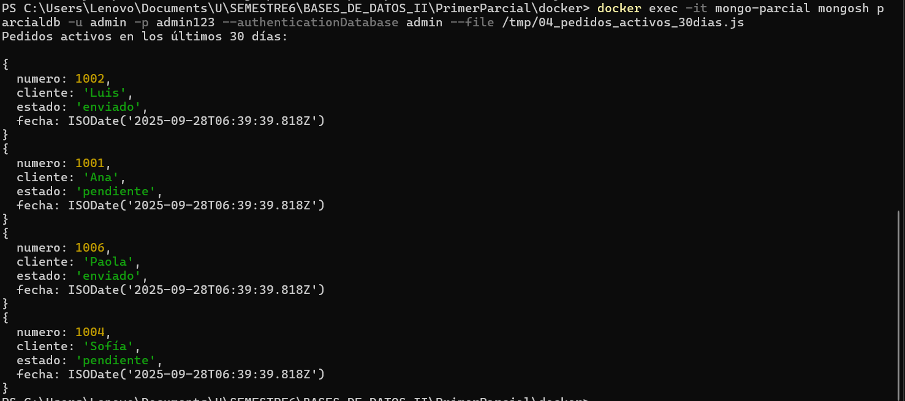
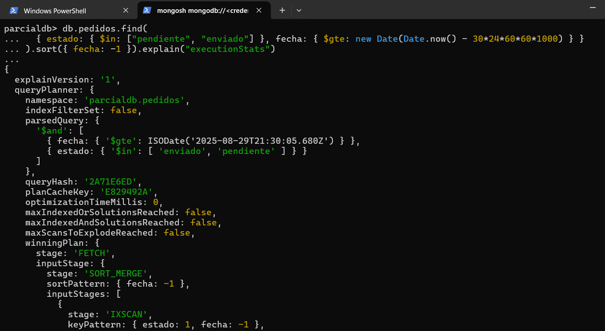

# Primer Parcial — Bases de Datos II

**Alumno:** Ashley Dayane Alfaro Aguilar 
**Curso:** Bases de Datos II  
**Universidad:** Universidad Da Vinci de Guatemala  
**Docente:** Brandon Antony Chitay Coutiño    
**Fecha:** 28/09/2025 


##  Descripción
Proyecto práctico con MongoDB y Docker que implementa la creación de contenedores, inserción de datos, vistas, consultas, índices y análisis de optimización.

## Tecnologías
- Docker
- MongoDB
- Mongo Express
- PowerShell
- Mongo Shell (`mongosh`)

##  Estructura
- `colecciones/`: scripts de carga inicial.
- `queries/`: consultas por tema (país, promedio, vistas, índices).
- `docker/`: configuración `docker-compose.yml`.
- `video/`: evidencia del proceso (opcional).
- `teoria/`: respuestas a las preguntas teóricas.

## Ejecución paso a paso
1. Inicia contenedor:
   ```bash
   docker compose up -d
2. Inserta datos:
   ```bash
   docker exec -it mongo-parcial mongosh parcialdb --file /tmp/pedidos.seed.js
   docker exec -it mongo-parcial mongosh parcialdb --file /tmp/pedidos.seed.extra.js
3. Crear vistas:
   ```bash
   docker exec -it mongo-parcial mongosh parcialdb --file /tmp/pedidosActivos.js
   docker exec -it mongo-parcial mongosh parcialdb --file /tmp/clientesVIP.js
4. Crear índice optmimizado 
   ```bash
   docker exec -it mongo-parcial mongosh parcialdb --file /tmp/05_create_index_pedidos_estado_fecha.js
5. Ejecutar consulta con índice y analizar plan
   ```bash
   db.pedidos.find(
   { estado: { $in: ["pendiente","enviado"] }, fecha: { $gte: new Date(Date.now() - 30*24*60*60*1000) } }
   ).sort({ fecha: -1 }).explain("executionStats")

### Evidencia de consulta
A continuación se muestra la consulta ejecutada en `mongosh`, que devuelve los pedidos activos filtrados y ordenados por fecha:



A continuación se muestra la consulta ejecutada en `mongosh`, que devuelve la evidencia de optimización:



